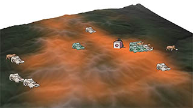
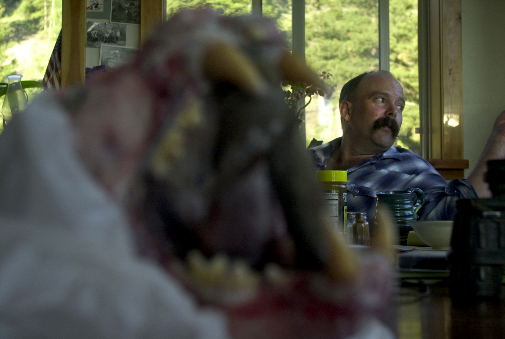
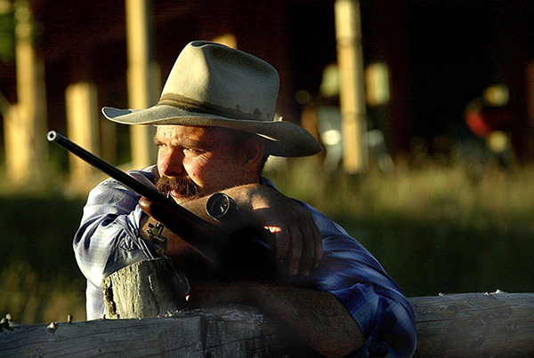
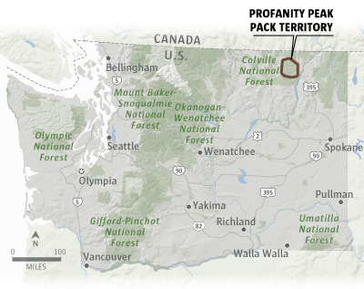

<?
<aside class="sidebar teaser desktop-only">
  <h3>Interactive</h3>
  <a href="#landscape">
    
    
What really happened to the Profanity Peak pack? Explore an interactive map.

  </a>
</aside>
?>

By a slow slide of river deep in Washington’s wolf country, Robert Wielgus laughs at the tattoo on his arm of Four Claws, the grizzly that almost killed him.

“I would rather face charging grizzly bears trying to kill me than politicians and university administrators, because it is over quickly,” said Wielgus, director of the Large Carnivore Conservation Lab at Washington State University.

A Harley-riding, self-described adrenaline junkie at home in black motorcycle leathers with a Stetson and a .357 in the pickup, Wielgus, 60, is no tweed-jacket academic. For decades he has traveled North America wrangling bears, cougars and wolves to collar and study their behavior, including collaborations with the Washington Department of Fish and Wildlife (WDFW).

<?
<aside class="sidebar teaser mobile-only">
  <h3>Interactive</h3>
  <a href="#landscape">
    
    
What really happened to the Profanity Peak pack? Explore an interactive map.

  </a>
</aside>
?>

Wielgus now finds himself crosswise with ranchers, lawmakers and WSU administrators — and their lobbyists. He’s lost grant funding for his summer research, has been forbidden from talking to media in his professional role and has been reviewed — and cleared — for scientific misconduct.

To understand why involves a look at state policy concerning a menagerie of animals: cougars, sheep, cattle and wolves. And one more animal: homo sapiens.

<?

  
  
A motion-triggered wildlife camera captures an image of members of the Profanity Peak pack July 30, 2016. The state Department of Fish and Wildlife killed six adults and a pup in the pack last summer. (Courtesy of WSU Wolf/Livestock Conflict Research program) 

?>

In Washington, it turns out, wolves and livestock are getting along better than the people who manage and study them.

Public Employees for Environmental Responsibility (PEER), a national nonprofit specializing in government scientist whistleblower protection, in April [filed a 12-page complaint](https://www.peer.org/news/press-clips/researcher-files-complaint-against-wsu.html) against WSU officials, alleging the university punished and silenced Wielgus to placate ranchers and state legislators who objected to his research. WSU officials declined to comment for this story, citing possible litigation.

The conflict started back in 2002, when Wielgus began publishing a series of influential papers that called into [question the practice of hunting cougars to reduce livestock losses.](http://www.seattletimes.com/seattle-news/is-cougar-hunting-breeding-chaos/) His research led to a reversal by Gov. Jay Inslee in October 2015 of Fish and Wildlife Commission [policy that would have allowed more hunting](http://www.seattletimes.com/seattle-news/environment/as-wolves-settle-in-the-states-cougars-to-pay-price/).

That was not long after Wielgus published a peer-reviewed paper that just as provocatively questioned killing wolves to protect livestock — a policy used by the WDFW by now to take aim at [four wolf packs, including two members of the Smackout Pack killed so far this month.](http://www.seattletimes.com/seattle-news/environment/states-wolf-kill-turns-up-the-heat-in-washington-cattle-country/)

His wolf study [made national news](https://www.nytimes.com/2014/12/04/us/washington-state-study-faults-efforts-at-wolf-management.html) with its finding that culling the predators can lead to more livestock kills, not fewer, because it destabilizes pack dynamics.

<?
  

    <iframe src='//players.brightcove.net/1509317113/3a88c7ac-7308-40e7-8334-1cfe33120b22_default/index.html?videoId=5536221060001' allowfullscreen frameborder=0></iframe>
  

?>

Normally for a university, national press for one of its researchers would be a point of pride. But the buzz over the paper alarmed lobbyists for WSU, hearing threats from state lawmakers that it was putting money for a new medical school and other pet projects in jeopardy.

Those legislators in turn were responding to ranchers and local officials seeking more lethal action from the department against wolves that harm livestock.

“ ... Highly ranked senators have said that the medical school and wolves are linked. If wolves continue to go poorly, there won’t be a new medical school,” Dan Coyne, lobbyist for WSU, wrote his colleague, Jim Jesernig, another WSU lobbyist, two days after the paper’s publication, state records show.

Jesernig, a well-connected former director of the state Department of Agriculture, and former member of the state House and Senate, agreed with Coyne, his partner at the Coyne, Jesernig lobbying firm. “That’s my assessment as well,” Jesernig wrote in an email copied to WSU Director of State Relations Chris Mulick. “ ... We are making the med school not doable.”

<?
<%= t.include("partials/_ad.html", { type: "square" })%>
?>

Replied Mulick, “We’re looking a wee bit like Sonny on the causeway here,” referring to a mob hit on a character in the movie “The Godfather.” “We’re getting in our own way on the med school enough as it is.”

A magazine story prepared by a writer for the university’s magazine and news service in advance of the wolf paper was spiked, Wielgus said. Just like a news release subsequently written, but never issued, on new cougar research out of Wielgus’ lab.

“WTF? What happened?” wrote Jon Keehner, co-author on that paper, to Wielgus.

Wielgus answered that the university was afraid of angering Republicans in the Legislature. He explained grant funds for his wolf work were now being funneled to his lab through another researcher, to take his name off the grant.

“That’s how bad it got,” John Pierce, chief scientist for WDFW’s wildlife program, said in an interview. Losing so-called principal-investigator status on a grant is a wound in academia, Pierce explained, where the ability to bring in grant money is a coin of the realm. Winning grants attracts top graduate students and helps researchers compete for more grants.

In particular, Wielgus had provoked Rep. Joel Kretz, R-Wauconda, a former Mercer Island resident turned cougar hunter, elected to the Legislature to represent the 7th District in Northeastern Washington.

<?
  

  

    

      
    

    

    

      
    

  

  

    Rancher Joel Kretz, photographed at his ranch in 2001, displays a dead cougar head on a table while talking to a reporter. Kretz, also shown with his rifle, said cougars were hurting his livestock and that ranchers needed more liberal hunting laws to fight back. He was elected to the Legislature in 2004.(Kevin German / The Seattle Times)
  

  

?>

Known for carrying the severed heads of cougars to public meetings — even plucking one for effect from his home freezer to sit, defrosting, on a table between himself and this reporter during an interview at his ranch — Kretz had butted heads with Wielgus from his first cougar papers that had thwarted Kretz’s efforts to increase cougar hunting in Northeastern Washington.

He attacked Wielgus’ wolf research, questioning its scientific validity to WSU officials, and opposed further funding for Wielgus.

Hans Dunshee, a former Snohomish Democrat and top budget writer, confirmed he cut a deal with Kretz in 2015 to sidestep Wielgus from the wolf research grant. “It was our way of sanitizing it while still keeping the money flowing,” said Dunshee, who retired from the Legislature last year. “I thought he was going to be OK.”

But he wasn’t.

<?
<%= t.include("_graphic.html") %>
?>

Knocked off the grant, Wielgus lost his summer salary for two years — during the peak season for wolf research — and his travel budget.

In the end, [money got tucked in for the medical school](https://spokane.wsu.edu/extra/2015/06/30/we-did-it-wsu-medical-school-funding-approved/), in the same budget that sidestepped the funding for Wielgus. The school will begin its first classes this fall.

Jesernig, in an interview, recalled well the trouble wolves caused as he worked the medical-school issue for WSU.

“It’s not a great secret; it happens to any lobbyist, you have a bill you work and all of a sudden you are in trouble with leadership, same thing here,” Jerserig said. “At the end of the day the good thing about the legislative process is mostly the merits of the issue will win out on the thing you are working on, and that is what happened on the medical school.”

### Outrage erupts

Already targeted for his wolf research, Wielgus poured gas on the fire last summer.

As the Profanity Peak pack started killing cows and the state launched a trapper and marksmen on the ground and in helicopters to protect the rancher’s cattle, Wielgus told The Seattle Times and other media outlets that Len McIrvin, a partner in the Diamond M, “chose to put his cattle [on top of the den site](http://www.seattletimes.com/seattle-news/environment/profanity-peak-wolf-pack-in-states-gun-sights-after-rancher-turns-out-cattle-on-den/).”

The implication that the rancher — whose livestock losses in 2012 also led to the state killing [the Wedge pack](http://www.seattletimes.com/seattle-news/state-learns-sad-lesson-with-wedge-pack-wolf-hunt/) — purposely put his animals in harm’s way to provoke the state’s ensuing kill of the Profanity Peak pack ignited a firestorm.

<? <%= t.include("_previously.html")%> ?>

Thousands of angry emails and phone calls from wolf advocates poured into the offices of the WDFW and the Colville National Forest, [home to many ranchers’ grazing allotments](http://www.seattletimes.com/seattle-news/environment/with-their-cattle-grazing-in-washingtons-wolf-country-ranchers-work-and-worry/). Donny Martorello, the department’s wolf-policy lead, hid his wife in a motel. McIrvin’s family unplugged the phone at the ranch to escape death threats.

Kretz, incensed, demanded an apology from WSU just as public as the remarks Wielgus had made — and got it. The university quickly issued a news release [disavowing Wielgus’s statements](http://www.seattletimes.com/seattle-news/environment/claim-that-rancher-turned-out-wolves-on-den-untrue-wsu-says/) and asserting that Wielgus had admitted he had no basis in fact for making them.

In a letter of concern written into his personnel file, Wielgus was instructed by Ron Mittelhammer, the dean of the College of Agriculture, Human and Natural Resource Sciences to have no further contact with the media without first clearing his statements with WSU. Wielgus duly went silent as the furor raged.

“He ought to be drawn and quartered and a chunk of him left everywhere in the district,” Kretz said in an interview then with The Seattle Times, saying Wielgus had a vendetta against McIrvin.

“I think he is agenda-driven; it’s incredible damage,” Kretz said. “This is not science, it is advocacy. I would say it’s beyond advocacy, it’s baldfaced lying to the public. I don’t want to see a nickel go through his hands.”

Wielgus says today that he could have been more diplomatic; his public remarks at the time included saying “go ahead and quote me: ‘Wherever McIrvin grazes ... dead wolves follow.’ Quote me. He’ll be proud of it!”

### Natural migration

Wolves are returning to the state on their own from Idaho and Canada, and have surged into Northeastern Washington, where most of the state’s 20 packs live. Diamond M operators had been warning the department about the Profanity pack since 2014, after three confirmed kills of its cattle by the pack. But what Diamond M ranchers and the department didn’t know as the ranchers loaded up their cattle for turnout in 2016 was the pack had moved much closer to the Diamond M’s operations on public grazing lands in the Colville National Forest.

<?

  

?>

Burned out by the Stickpin fire in 2015, the wolves had moved their den from the previous year to within 5 miles of the Diamond M’s usual turnout site for the CC Mountain grazing allotment, and a quarter-mile from the salt lick put out in the same spot every year to draw cows up from lowland pastures to the mountain.

<?

  

?>

<?<%= markdown.mountain %>?>

The WDFW carried on most of the summer and into the fall killing wolves, eventually taking the lives of six adults and a pup in the pack. The department confirmed the pack killed five Diamond M calves and one cow from another ranch.

For all the controversy, Wielgus said he is still optimistic wolves will recover from local extinction in Washington. He doesn’t think the same for himself.

The news release disavowing his statements was never shown to him, Wielgus said, and misconstrued a short conversation by phone between him and Mittelhammer.

While he has since attained tenure, Wielgus said he no longer wants to work at the university. “They called me a liar and ruined my career.”

<?
  

  
  
 Robert Wielgus gets ready to listen for the radio collar on the sole surviving adult of the Profanity Peak pack, mostly killed off by the Washington Department of Fish and Wildlife last summer for killing ranchers’ cattle. (Steve Ringman / The Seattle Times) 

?>

### Confusing message

Wielgus’ conflicts with the university would continue, after he emailed a news release reporting the latest findings from his lab to the state’s Wolf Advisory Group (WAG) and others as the group debated wolf policy for 2017.

Wolf kills of livestock were exceedingly rare, [Wielgus reported](https://intheshadowofthewolf.wordpress.com/2017/03/27/press-release-wolf-livestock-depredation-in-wa-and-profanity-peak-pack/), occurring in fewer than 1 percent of the livestock tracked by his lab. Only in the case of the Profanity Peak pack, where cattle and a salt block to attract them were milling around the wolves’ activity area, had there been multiple calf kills, more than anywhere else surveyed, Wielgus reported.

Wielgus had sent the release to WSU communications staff and administrators and received preapproval by Mittelhammer before putting it out as his personal opinion and not on behalf of the university, as they requested. But that strategy, intended to create distance between Wielgus and WSU, just created confusion.

<?
<%= t.include("partials/_ad.html", { type: "square" })%>
?>

In an email to Mulick, the WSU state relations director, Tom Davis, of the Washington Farm Bureau and a WAG member, objected that Wielgus was sending out a press release about his publicly funded research findings but labeling them his personal opinion. He also said he wouldn’t attend the meeting if Wielgus was allowed to speak.

Mittelhammer went into response mode, personally meeting with Kretz and other lawmakers, then attending the advisory group meeting with several WSU officials. He followed up with a letter to lawmakers on April 12 reassuring them “while an irritant, the deliberations of the WAG were fortunately not significantly affected by Dr. Wielgus’ attempt to influence the group’s deliberations through the dissemination of his so-called “press release” document.

“That said, on a more individual and personal basis, it did also appear that Dr. Wielgus’ actions did negatively impact a number of individuals in the room who felt that the document reinvigorated negative feelings toward ranchers by wolf protectionists.”

He assured the lawmakers he had sent Wielgus a second “memo of concern,” and promised to follow up with investigations of whether Wielgus had broken state law by illegal lobbying and sending the press release on his state email account. He also promised an internal review of Wielgus’ 2014 wolf paper.

By May, Schulz informed Mittelhammer he was concerned WSU might be branded with an “anti-ranching sentiment.”

In other emails, the university president and Mittelhammer agreed they needed to address the school’s relationship with ranchers in future faculty hires. “I feel that they need an internal champion or person that they can work with,” Schulz wrote.

### “No evidence of misconduct”

By then, WSU had cleared Wielgus of any scientific wrongdoing. On May 29, Christopher Keane, the vice president for research at WSU, wrote Kretz and Senate Majority Leader Mark Schoesler, R-Ritzville, thanking them for meeting with him in Olympia to express concern about Wielgus’ research.

However, the result of the subsequent independent review completed by a WSU statistician was clear: “There is no evidence of misconduct in this matter,” Keane wrote.

But for faculty at WSU, the message nonetheless was clear, said Donna Potts, president of the local chapter of the American Association of University Professors (AAUP), the nation’s oldest and largest advocacy group for academic freedom. “It was very disturbing; I had never seen anything like it,” Potts, a member of the English department, said of WSU’s treatment of a senior faculty member.

<?

  
  
 Robert Wielgus relaxes at his wolf camp, used when trapping and collaring wolves for his work studying the interactions of cattle and wolves. His studies have found most wolves don’t attack livestock and that killing wolves to protect cattle and sheep can be counterproductive, leading to more mayhem by socially destabilized wolf packs. (Steve Ringman / The Seattle Times) 

?>

Cary Nelson, former national president of the AAUP, who spoke on the issue at WSU last spring, said pressure from industry and from lawmakers friendly to it is nothing unusual. “But it’s up to a university to protect its faculty.”

Actions by state lawmakers and WSU administrators such as those taken against Wielgus have a “chilling effect” on research that could be perceived as controversial, Nelson said.

Scientists who have worked with Wielgus said they are concerned by what they see.

“It’s not that Rob hasn’t stirred up the hornets’ nest — he can test the limits and some people think he is not very diplomatic,” said Gary Koehler, of Wenatchee, who collaborated with Wielgus on bear and cougar research before retiring from the department after 14 years. “But he is a straight shooter.

“Rob is without a doubt one of the top carnivore ecologists in North America. I think Rob has been thrown under the bus.”
